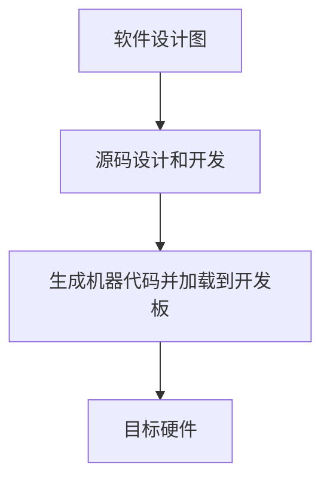
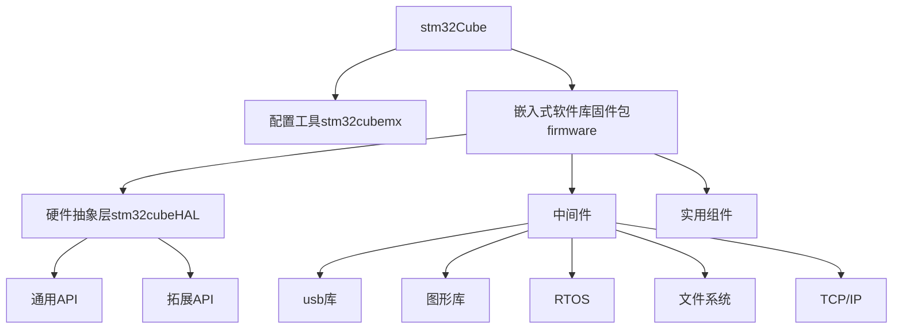

### 1.基本步骤

```mermaid
graph TD;
  软件设计图-->源码设计和开发-->生成机器代码并加载到开发板-->目标硬件;
```
### 2.stm32cube软件工具

```mermaid
graph TD;
  stm32Cube-->配置工具stm32cubemx;
  stm32Cube-->嵌入式软件库固件包firmware;
  嵌入式软件库固件包firmware-->硬件抽象层stm32cubeHAL;
  嵌入式软件库固件包firmware-->中间件;
  嵌入式软件库固件包firmware-->实用组件;
硬件抽象层stm32cubeHAL-->通用API;
硬件抽象层stm32cubeHAL-->拓展API;
中间件-->usb库;
中间件-->图形库;
中间件-->RTOS;
中间件-->文件系统;
中间件-->TCP/IP;
```
